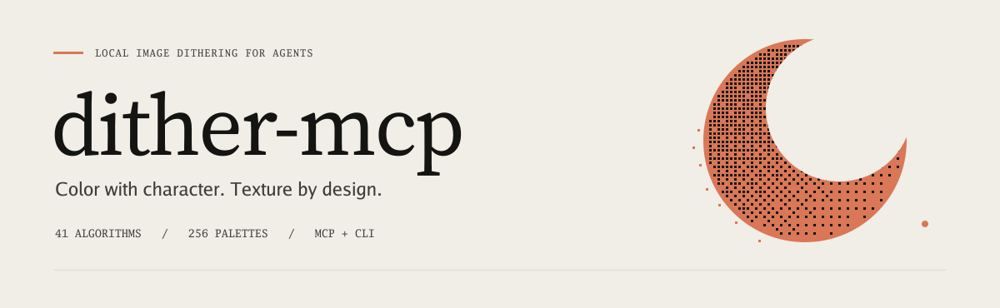
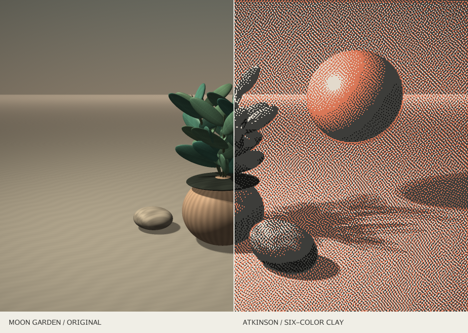
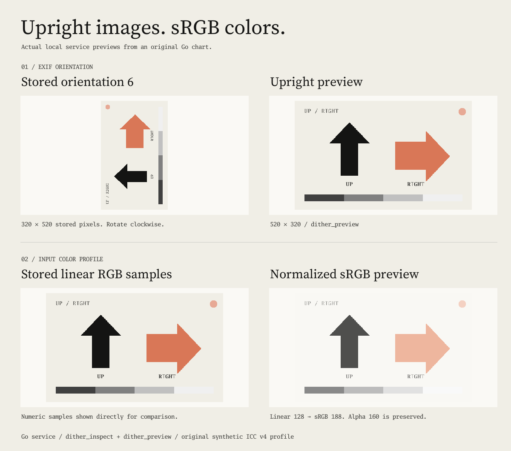
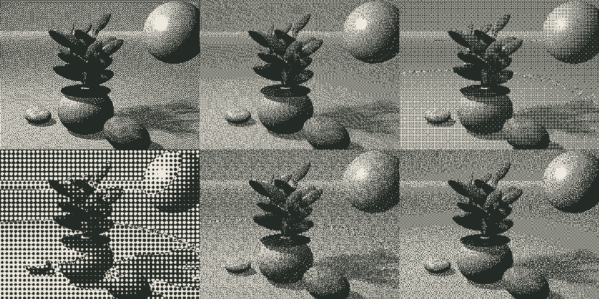
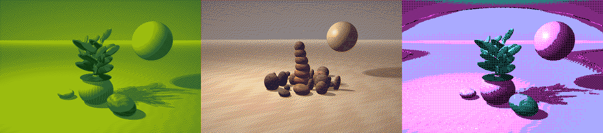
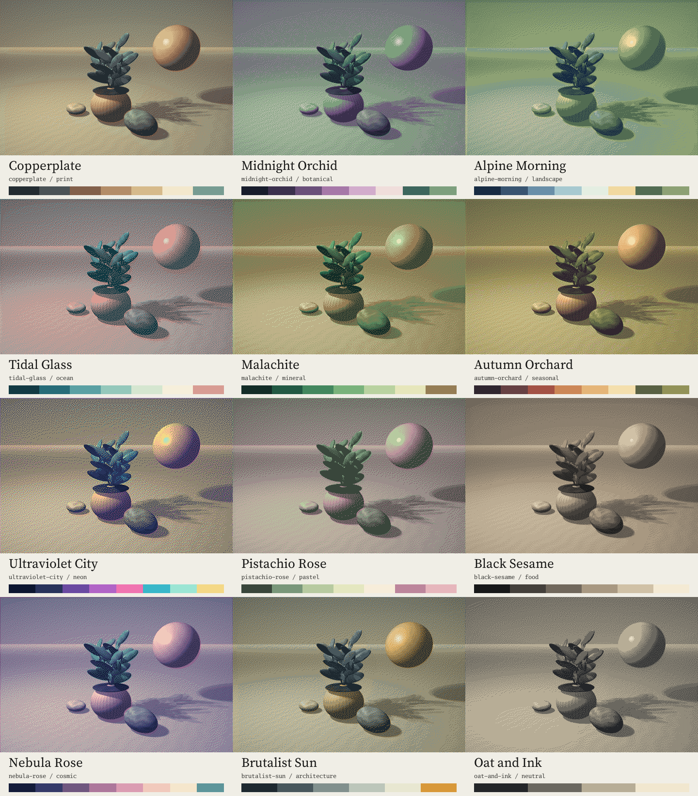
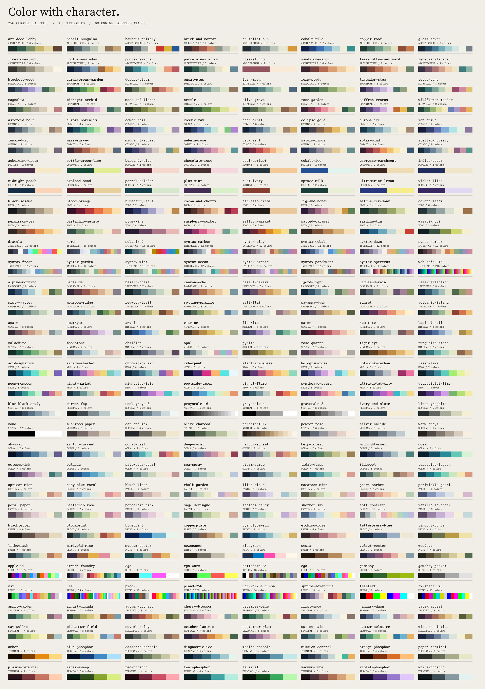
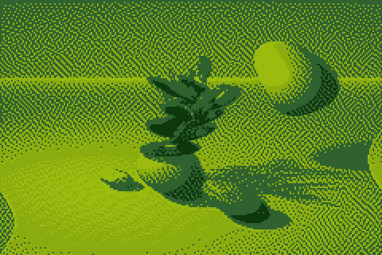
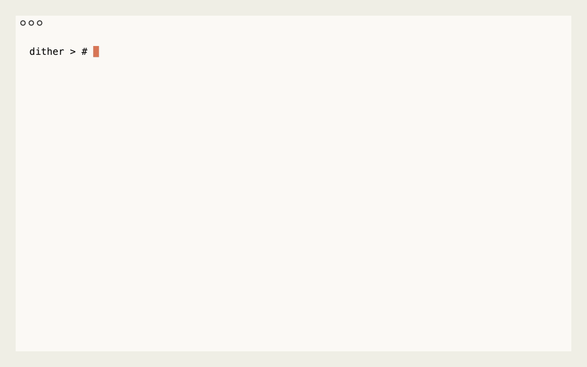
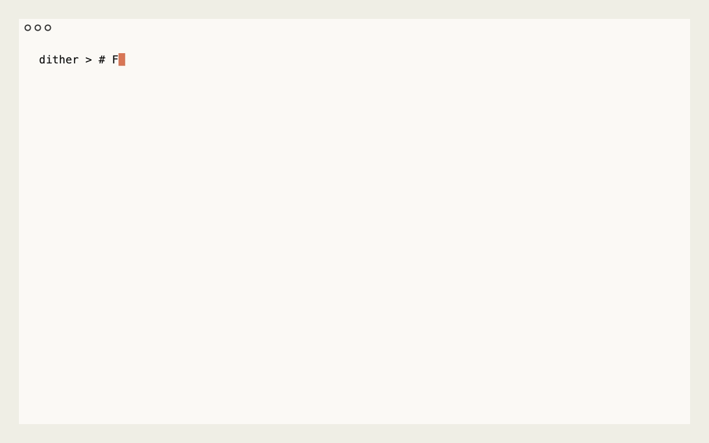

# dither-mcp

**Color with character. Local image dithering for your agent.**

dither-mcp is a local-first [Model Context Protocol](https://modelcontextprotocol.io/) server for image dithering. Your agent can inspect images, compare algorithms, apply palettes, and save recipes. One Go binary provides the same image pipeline through MCP and the CLI.



*Moon Garden original → Atkinson / six-color clay palette / 2× pixels. Local Go programs generated the artwork and dithered treatments.*

[Connect your agent](#connect-your-agent) · [Explore the showcase](#explore-the-gallery) · [Watch the demos](#see-it-run) · [Read the specifications](#specified-and-verified)

[Source code](https://github.com/lennrt/dither-mcp) · [Showcase source](https://github.com/k-a2a/dither-mcp-site)

## What your agent can do

The toolkit provides **13 tools with typed inputs**, **2 resources**, and **3 prompts**. It includes **41 dithering algorithms**, **256 curated palettes**, and custom palettes. It also supports image adjustments, masks, retro effects, comparison sheets, batch renders, motion, and print exports. Tools return structured results. File-producing tools also return local artifact paths and SHA-256 digests. Image artifacts include dimensions.

| Ask your agent | Workflow |
|---|---|
| “Find four warm colors for a botanical print.” | Filter `dither_palettes` by name, category, and color count → `dither_render` |
| “Build a palette from this image’s own colors.” | `dither_inspect` → `dither_palette_extract` → `dither_render` |
| “Show me Atkinson, Floyd–Steinberg, and Bayer side by side.” | `dither_catalog` → `dither_compare` |
| “Apply the same settings to this folder of images.” | `dither_recipe_load` → `dither_batch` |
| “Dither the subject. Keep the background. Add CRT texture.” | `dither_render` with a geometric or local image mask and effects |
| “Create a short looping animation from this image.” | `dither_animate` → GIF or sprite sheet |
| “Process a short clip with this palette.” | `dither_video`, with local FFmpeg enabled |
| “Keep the settings so I can make this again.” | `dither_recipe_save` |
| “Show me the result. Create separate print plates.” | `dither_preview` → `dither_separate` |

Image processing stays in your configured workspace, with source files and artifacts under your control. Your connected MCP host receives tool results and controls which information reaches its model.

## Supported files

| Workflow | Input | Output |
|---|---|---|
| Still images | PNG, JPEG, GIF, WebP, BMP, and TIFF | PNG, JPEG, GIF, SVG, PBM, and ASCII |
| Generated animation | One supported still image | Animated GIF or a PNG sprite sheet |
| GIF animation | Animated GIF | Animated GIF or a PNG sprite sheet |
| Video | MP4, MOV, WebM, Matroska, and AVI | MP4 (H.264), WebM (VP9), GIF, or a PNG sprite sheet |
| Print separation | One supported still image | ZIP with PNG ink plates and a JSON manifest |

Still-image tools use the first GIF frame. To process every GIF frame, use `dither_animate` with `effect: "source"`. GIF animation defaults to this mode. It preserves frame composition, disposal, delays, and loop count.

Generated animations start from one still image. Print separation supports at most 16 inks.

Video processing requires **`--allow-video`** and local **FFmpeg** and **ffprobe** executables. It processes short, bounded segments and exports video without audio. Available input decoders and output codecs depend on your FFmpeg build.

Still-image tools apply all eight EXIF orientations before cropping and resizing. They convert supported embedded RGB ICC profiles to sRGB and preserve alpha. Untagged RGB images use sRGB.

Read the [format guide](docs/formats.md) for profile coverage, file behavior, codec requirements, and video limits.

<details>
<summary>See orientation and color normalization</summary>



*Stored pixel samples appear at left. Actual service previews appear at right. [Reproduce this original chart and inspect its results](docs/formats.md#reproduce-the-comparison).*

</details>

## Connect your agent

Build from this source checkout with **Go 1.27**:

```sh
git clone https://github.com/lennrt/dither-mcp.git
cd dither-mcp
go mod download
go build -o bin/dither-mcp ./cmd/dither-mcp
./bin/dither-mcp catalog
```

For an MCP client that uses an `mcpServers` configuration, supply absolute paths:

```json
{
  "mcpServers": {
    "dither": {
      "command": "/absolute/path/to/dither-mcp/bin/dither-mcp",
      "args": ["mcp", "--root", "/absolute/path/to/images"]
    }
  }
}
```

1. Reconnect the client.
2. Ask it to inspect an image.
3. Ask it to compare a few algorithms.

Paths in tool calls are relative to `--root`. The server exchanges MCP messages on stdin/stdout and sends diagnostics to stderr.

See the [MCP guide](docs/mcp.md) for schemas, examples, resources, prompts, and limits. The [CLI guide](docs/cli.md) documents direct use of the same operations.

## Explore the gallery

The Moon Garden is a waxy-leaf plant in a fluted ceramic pot, with textured stones and a suspended golden sphere. A deterministic Go ray tracer creates its light, shadows, veins, grain, and mineral bands. Each algorithm converts these surfaces into a distinct pixel pattern.



*Left to right, top to bottom: Atkinson · Floyd–Steinberg · Bayer 8×8 · dot screen 8 · blue noise · Riemersma. Same crop, two warm colors, fixed seed.*



*Atkinson / Game Boy · Floyd–Steinberg / custom ember · Bayer 4×4 / CGA.*

### Every palette. A new possibility.

The catalog includes **256 palettes across 16 categories**. Names, descriptions, tags, color counts, and hex values help your agent find a palette. Every palette has a stable ID. Use that ID in renders and recipes.

The categories are:

- Retro, terminal, interface, and print.
- Duotone, botanical, landscape, and ocean.
- Mineral, seasonal, neon, and pastel.
- Food, cosmic, architecture, and neutral.



*The twelve images use the same source and Floyd–Steinberg settings. [View the complete 256-palette atlas](docs/assets/palette-atlas.png). Read the [palette guide](docs/palettes.md) for descriptions, sources, and exact colors.*

<details>
<summary>Explore the complete color atlas</summary>



</details>

```sh
./bin/dither-mcp palettes --category botanical \
  --min-colors 4 --max-colors 6 --limit 8

./bin/dither-mcp palettes --query 'oat ink'

./bin/dither-mcp render --root . \
  --input docs/assets/source/moon-garden.png \
  --output oat-garden.png \
  --algorithm floyd-steinberg --palette oat-and-ink \
  --width 960 --pixel-scale 2
```

Use a preset or supply **2–256 unique hex colors**. Custom palettes are explicit recipe inputs. Extract a palette from a local image when you want the image’s own colors to guide the result.

```sh
./bin/dither-mcp render --root . \
  --input docs/assets/source/mineral-nocturne.png \
  --output mineral.png \
  --algorithm floyd-steinberg \
  --colors '#251d32,#ab4e3b,#e6ad62,#f0e7d3' \
  --width 960 --pixel-scale 2
```



*Wave / 24 frames / 12 fps. [Reproduce the artwork and recipes](docs/showcase.md).*

The separate [showcase repository](https://github.com/k-a2a/dither-mcp-site) contains a static site prepared for GitHub Pages. It includes a keyboard-accessible comparison slider, actual algorithm previews, a searchable palette explorer, palette studies, and recorded demos. Its bundled HTML, CSS, JavaScript, media, and local fonts are ready to serve directly.

## Make a reproducible recipe

Start with an inspection and a comparison sheet:

```sh
./bin/dither-mcp inspect --root . \
  --input docs/assets/source/moon-garden.png

./bin/dither-mcp compare --root . \
  --input docs/assets/source/moon-garden.png \
  --output comparison.png \
  --algorithms atkinson,floyd-steinberg,bayer-8 \
  --palette sepia --width 320
```

Save the settings in a versioned recipe. Use that recipe to render the image:

```sh
./bin/dither-mcp call --root . dither_recipe_save '{
  "output": "garden.recipe.json",
  "recipe": {
    "version": 1,
    "palette": "gameboy",
    "options": {
      "algorithm": "atkinson",
      "width": 960,
      "pixel_scale": 2,
      "seed": 42
    }
  }
}'

./bin/dither-mcp render --root . \
  --input docs/assets/source/moon-garden.png \
  --output garden.png --recipe garden.recipe.json
```

Recipes keep image settings portable across source files and destinations. A render result includes the resolved recipe and artifact digest. Explicit seeds make noise, glitch, and animation reproducible. For a saved recipe, apply the complete configuration. For a new treatment, supply inline settings.

A new output path preserves your earlier work. Give each variation a separate name.

## The toolkit

| Area | Included |
|---|---|
| Error diffusion | Floyd–Steinberg, Atkinson, Jarvis–Judice–Ninke, Stucki, Burkes, Sierra variants, Fan variants, Stevenson–Arce, and others |
| Screens and noise | Bayer 2–32, clustered dots, dot screens, line screens, crosshatch, diamonds, spirals, waves, seeded uniform noise, and blue noise |
| Curve traversal | Riemersma with Hilbert traversal |
| Color | Built-in and custom palettes, deterministic palette extraction, sRGB and linear-light RGB matching |
| Input normalization | Automatic EXIF orientation, supported ICC v2/v4 RGB matrix/TRC profiles, and PNG color metadata |
| Image controls | Resize, crop, crisp pixel scale, brightness, contrast, gamma, saturation, threshold, strength, grayscale, invert, and serpentine diffusion |
| Selection | Rectangular, circular, inverted, and local image masks |
| Retro effects | Scanlines, CRT shading, seeded noise, row glitch, and pixel sorting |
| Still exports | PNG, JPEG, GIF, SVG, PBM, and ASCII |
| Print workflows | PNG resolution metadata and spot-color separation plates in a ZIP |
| Motion | Source GIF frames, generated GIF loops, sprite sheets, and bounded local video processing with FFmpeg |
| Agent workflows | Inspect, discover, compare, batch, save, and reload recipes |

The engine preserves source alpha. Diffusion stops at transparent pixels and mask boundaries. Regions outside the mask retain adjusted source colors. Post-effects can introduce colors beyond the selected palette. See the [feature matrix](docs/feature-matrix.md) for precise coverage and the [architecture](docs/architecture.md) for pipeline order and boundaries.

## See it run

[Charmbracelet VHS](https://github.com/charmbracelet/vhs) recorded these local demos. They use the binary and original artwork from this checkout.



*[Watch the render clip](docs/assets/render.mp4).*


*[Watch the comparison and animation clip](docs/assets/compare.mp4).*


*[Watch the MCP clip](docs/assets/mcp.mp4). The scripted Go client connects to the real stdio server and is ready to replay locally.*



*[Watch the palette discovery clip](docs/assets/palettes.mp4). Search, select, render, and keep the resulting recipe.*

Recreate the source art and gallery with `./scripts/showcase.sh`. Record the terminal clips with `./scripts/showcase-record.sh`. The [showcase guide](docs/showcase.md) lists prerequisites, exact recipes, asset provenance, and recording checks.

## Specified and verified

[OpenSpec](openspec/) records the requirements, scenarios, and implementation changes. [Quint models](spec/) describe input normalization, quantization, artifact publication, and bounded palette discovery. The formal models abstract pixel values, operating-system behavior, and process execution. Their checks complement implementation tests.

```sh
make verify
make spec-install
make spec-check
```

The specification tools are development-only dependencies and require Node 20.19+ and pnpm. See [testing](docs/testing.md) for the checks, their recorded outcomes, and what they establish. [Security](docs/security.md) explains the filesystem boundary, limits, and optional FFmpeg integration.

## License and credits

The project uses the MIT license. See [LICENSE](LICENSE) and [third-party notices](THIRD_PARTY_NOTICES.md). Original showcase artwork and recordings use the same license. The [sources guide](docs/sources.md) lists algorithm references and inspiration. It also records the references and platform credits for classic techniques and retro palettes.
