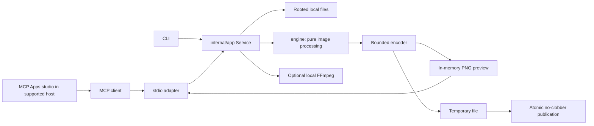

# Architecture

`dither-mcp` is a synchronous local image service. MCP and the CLI use the same application layer, which controls filesystem access and workflow limits. The public `engine` package processes images in memory. It never opens files, starts processes, or uses the network.

## Package boundaries

| Area | Responsibility |
|---|---|
| `engine` | Validation, algorithms, palettes, extraction, resampling, masks, effects, still encoders |
| `internal/app` | Rooted inputs, metadata, recipes, limits, comparison/batch/motion/print workflows, atomic artifacts |
| `internal/mcpserver` | Typed tool registration, structured results, PNG preview content, embedded MCP Apps resource, and prompts |
| `ui` | Studio source, pinned SDK build, self-contained HTML bundle, and app bridge tests |
| `internal/cli`, `cmd/dither-mcp` | CLI arguments, process lifecycle, bounded stdio framing, and stdout/stderr discipline |
| `openspec` | Normative requirements, concrete scenarios, initial-suite, palette-library, and input-normalization changes |
| `spec` | Executable finite Quint contracts and reproducible validation harness |
| `docs`, `examples` | Guides, recorded demonstrations, source examples, rendered artwork |

The service has no job database, detached background processing, cloud library, or runtime Node dependency. A running server serializes application operations to bound concurrent allocations. Different processes can still work in the same root. Atomic publication resolves destination collisions.

## Image pipeline

The service and engine apply these steps in order:

1. Parse strict JSON. Resolve either inline options or one version-1 recipe.
2. Read a regular local file through `os.Root`. Enforce byte limits. Inspect stored dimensions before decoding.
3. Validate supported input metadata. Apply EXIF orientation and normalize input color to sRGB.
4. Resolve a named palette or validate custom opaque hexadecimal colors.
5. Validate engine options and crop/output dimensions against the upright source.
6. Crop the image. Resample it to the processing grid.
7. Apply contrast, brightness, gamma, saturation/grayscale, and inversion.
8. Quantize selected pixels with the chosen algorithm and color-distance space. Stop error diffusion at selection and transparency boundaries.
9. Apply optional scanline, CRT, noise, glitch, or pixel-sort effects on the grid.
10. Enlarge the grid with nearest-neighbor sampling to the exact final dimensions.
11. Encode within the output byte budget. Publish a new artifact.

For final dimensions `W × H` and `pixel_scale = S`, the processing grid is `ceil(W/S) × ceil(H/S)`. An omitted or zero scale means 1. Crop coordinates refer to upright source pixels after orientation. Mask coordinates refer to the reduced processing grid.

Pixels outside a mask retain their **adjusted** source values. Post-effects run across the rendered grid, including outside a mask. Neither masked output nor post-effects guarantee that all visible pixels belong to the selected palette.

Omitted pointer-valued adjustments use neutral defaults. Explicit zero remains meaningful for contrast, saturation, strength, and threshold. Gamma is strictly positive. The engine uses unassociated RGB for partially transparent source pixels and retains alpha. Bilinear resizing uses premultiplied interpolation to avoid transparent-edge halos. The engine normalizes fully transparent pixels to transparent black.

The service normalizes inputs before calling the engine. JPEG, PNG, WebP, and TIFF can supply EXIF orientation and supported ICC v2/v4 RGB matrix/TRC profiles. BMP V5 supports embedded profiles from the same ICC subset. BMP V4/V5 accepts sRGB and Windows default declarations. PNG can also supply supported `cICP`, `sRGB`, `gAMA`, and `cHRM` chunks. Untagged RGB inputs use sRGB. Image masks follow the same normalization rules. [The format guide](formats.md#orientation-and-input-color) defines precedence, profile coverage, and rejection behavior.

Normalization preserves source alpha, including 16-bit alpha. The engine’s subsequent image pipeline uses 8-bit pixels. Conversion clips colors outside the sRGB range. The output encoders omit source EXIF and ICC metadata and use sRGB pixel values.

Color distance is squared Euclidean distance in either sRGB values or linearized RGB. `linear-rgb` changes quantizer distance and propagated errors after input normalization. Gamma and creative adjustments retain their documented display-space interpretation. The color-distance option does not select an input or output ICC profile.

## Agent workflow

The server exposes 14 tools: catalog, palettes, inspect, preview, studio, palette extraction, render, compare, batch, animate, video, separate, recipe save, and recipe load. `dither://capabilities` contains the live catalog and limits. `dither://workflow` supplies usage context. `ui://dither/studio.html` supplies the embedded studio. The `art_director`, `prepare_print`, and `make_loop` prompts describe common workflows.

A typical agent follows this workflow:

1. Discover valid IDs.
2. Inspect source dimensions.
3. Render a comparison.
4. Read the comparison through `dither_preview`.
5. Choose a look.
6. Render the final artifact.
7. Save its recipe.

Candidate cell coordinates identify each comparison image without text embedded in the pixels. CLI operations call the same service as tools.

## Embedded studio

`dither_studio` adds an optional graphical view through the [MCP Apps extension](https://modelcontextprotocol.io/extensions/apps/overview). The tool remains read-only. It loads a rooted source, applies the shared engine pipeline, and encodes a bounded PNG in memory. It returns the image, metadata, and resolved version-1 recipe without entering the artifact publication path.

When dimensions are omitted, the preview fits within 512 × 512 pixels without enlargement. Explicit dimensions, including a dimension derived from aspect ratio, must stay within 1,024 pixels per axis. Encoded PNG data stays within 2 MiB. Studio seed values use the safe JavaScript integer range.

The tool's `_meta.ui.resourceUri` points to `ui://dither/studio.html`. This third resource uses `text/html;profile=mcp-app`. It embeds HTML, CSS, and JavaScript built with the official `@modelcontextprotocol/ext-apps` SDK. Development tools create the bundle. The Go binary embeds and serves it with no runtime Node.js process or external asset request.

A supporting host displays the resource and bridges app tool calls to the same stdio server. The controls discover algorithms and palettes, apply read-only previews, and inspect the image and swatches. The app keeps the recipe from the last successful preview. **Save image** calls `dither_render` with that exact recipe and a user-selected new relative destination. Changes that have not produced a successful preview cannot silently change the saved result.

Hosts must support both MCP Apps and local stdio servers to display this view. Other hosts receive the PNG and structured JSON from `dither_studio`. The original 13 tools retain their existing tool results. See the [MCP Apps guide](mcp-apps.md) for the detailed host and verification contracts.

The embedded [palette library](palettes.md) contains 256 presets across 16 categories. Discovery filters by text, category, and color count. It then sorts by ID and returns a bounded page. Text terms combine with AND across palette identifiers, names, descriptions, categories, tags, origins, and color values. An empty request returns 32 entries. `limit` accepts up to 256.

Continue with `next_offset` and unchanged filters. Results report the complete catalog's `total`, the filtered `matched` count, and the current page's `count`. Category counts always describe the complete catalog. Rendering uses the original palette order, independent of discovery's ID sorting.

Artifact responses contain these fields:

- Relative path, format, dimensions, and frame count when applicable.
- Byte length and SHA-256.
- Processing recipe and engine version.
- Operation name and complete submitted operation parameters.

A recipe specifies the still-image look. Source selection and workflow parameters belong to the operation request. These parameters include animation effect, frame count, FPS, and comparison candidates. Preserve those parameters with the source to reproduce a complete workflow.

Another local process can change input-file content during an operation. The service does not lock that content. Inspection hashes identify the bytes actually read.

## File authority and transactions

The service accepts only relative local paths. Before opening files, it rejects absolute paths, URL-like forms, parent traversal, NUL/newline characters, and backslash/colon forms. `os.Root` supplies traversal-resistant filesystem access on supported native operating systems. Symlinks that escape the root fail.

The service checks for a regular file before and after opening it. POSIX opens use `O_NONBLOCK`. A checked file replaced with a FIFO therefore cannot block the open.

Each output is one transaction:

1. Encode a complete bounded artifact.
2. Open its parent directory through the root.
3. Create a random exclusive temporary file with mode `0600` in that parent.
4. Write the file. Sync it. Close it. Check cancellation.
5. Hard-link the temporary file to the requested destination. The link fails if the destination exists.
6. Remove the temporary name.

There is no overwrite option. A concurrent collision has at most one winner. This contract requires a local filesystem that supports hard links. Unsupported filesystems return an error without attempting a destructive rename. The implementation syncs file contents before publication. It does not claim power-loss durability for the parent directory entry.

An unclean process termination may leave a temporary file. It never leaves a partially published destination.

Cancellation is cooperative. A cancellation **observed before publication** stops that publication. A cancellation that arrives after the final check may race with a successful atomic commit. The complete artifact may exist even if a client stops waiting. The service bounds standard-library codec calls, but does not interrupt them on every pixel.

Batch items commit independently. Earlier successes remain when a later item fails or cancellation stops the sequence.

## Resource limits

| Limit | Value |
|---|---:|
| JSON request | 1 MiB |
| Input file / encoded artifact | 32 MiB each |
| Expanded ICC profile / EXIF payload | 4 MiB each |
| ICC tags / tone-curve samples | 256 / 65,536 |
| EXIF IFD0 entries | 4,096 |
| Image pixels | 16,777,216 |
| Image dimension | 16,384 pixels per axis |
| Aggregate animation pixels | 67,108,864 |
| Animation frames | 120 |
| Batch / comparison candidates | 32 / 12 |
| Operation timeout, including admission wait | 120 seconds |
| Source preview | Default width 512 pixels. At most 1,024 pixels per axis and 2 MiB. |
| Studio preview | Default fit within 512 × 512 without enlargement. At most 1,024 pixels per axis and 2 MiB. |
| Custom/extracted palette | 2–256 requested colors |
| Palette discovery | Default 32 entries per page. At most 256 entries per page and 256 UTF-8 query bytes. |
| Print inks | At most 16 |

These limits bound work, not memory use. Processing can temporarily retain decoded source, floating-point error buffers, quantized output, animation frames, and encoded bytes. Peak memory use may reach several hundred MiB near maximum animation bounds. Use smaller dimensions and frame counts for constrained machines.

## Motion and print

The service scans GIF containers before `gif.DecodeAll` to bound frame count and cumulative logical-screen pixels. It composites source frames on the logical canvas and handles keep, background, and previous disposal. It honors opaque global backgrounds. As documented by the compositor, a frame clears to transparent when its transparent palette index equals the background index. The service retains source delays and loop counts.

Generated animations have explicit finite phases. GIF delays use integer centiseconds. PNG sprite sheets use row-major layout and may include unused trailing cells.

Video is opt-in. FFmpeg receives a private local staging copy and a forced allowlisted container demuxer. It also receives bounded frame count, dimensions, duration, and fixed generated output paths. No request text becomes a shell command. MP4 uses H.264. WebM uses VP9.

Video frames have padding to make their dimensions even. Video output omits audio. The tool also exports GIF and PNG sprite sheets. FFmpeg version and codec availability affect encoded bytes.

Print separation renders a palette-limited image. It then generates one black-on-white PNG mask per ink and a manifest in a single ZIP. Black means ink coverage. PNG DPI is explicit density metadata. It neither changes pixel dimensions nor calibrates a printer.

These spot-color masks do not provide CMYK conversion, output device profiles, trapping, or overprint simulation. Input profile normalization does not calibrate press results.

## Specifications and refinement

OpenSpec captures user-visible requirements and records their implementation changes. Quint checks deliberately small abstractions:

- Atomic publication under collisions and cancellation.
- Deterministic quantization and selection.
- Bounded filtered palette discovery.
- Source normalization admission, orientation, alpha, and processing order.
- Read-only studio previews and explicit saves of the last successful recipe.

[The specification guide](../spec/README.md) lists assumptions, executable scenarios, verification bounds, and corresponding Go tests. Passing models provide evidence about those models. They do not prove that Go, codecs, or the operating system refine them.
