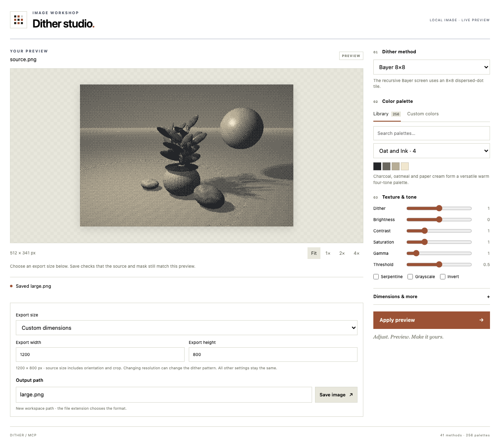

# Hosts and installation

dither-mcp uses local **stdio** transport. Interactive rendering additionally requires the host to negotiate the `io.modelcontextprotocol/ui` extension and support app-initiated server tool calls. A host without that extension still receives the preview PNG, structured metadata, and recipe from `dither_studio`.

The table records documentation reviewed on **2026-10-08**. “Documented” means the vendor describes that capability; it does not mean this project's studio has been tested in that application.

| Host | Local stdio | Interactive studio | Evidence |
|---|---|---|---|
| Official MCP Inspector 2.10.1 | Tested | Preview, app tool calls, guarded save, larger export, changed-source protection tested | Published npm package; real Go stdio server; [verification report](host-verification.json) |
| This repository's embedding example | Tested | Tested | Real Go server, official AppBridge, Chromium; [embedding guide](embedding.md) |
| VS Code with Copilot | Documented | MCP Apps documented; dither-mcp untested here | [MCP developer guide](https://code.visualstudio.com/api/extension-guides/ai/mcp) |
| Cursor desktop | Documented | MCP Apps documented; dither-mcp untested here | [Cursor MCP integrations](https://cursor.com/help/customization/mcp) |
| Claude Desktop | Documented | MCP Apps documented by the MCP project; dither-mcp untested here | [Local servers](https://modelcontextprotocol.io/docs/develop/connect-local-servers), [MCP Apps](https://modelcontextprotocol.io/extensions/apps/overview) |
| Codex CLI / IDE extension | Documented | Use the PNG/recipe fallback; interactive studio support is not established by the cited documentation | [OpenAI MCP configuration](https://learn.chatgpt.com/docs/extend/mcp?surface=cli) |
| ChatGPT hosted app | No direct local stdio installation | MCP Apps documented, but this binary's local setup is not a direct hosted connector | [OpenAI connect and test guide](https://developers.openai.com/plugins/deploy/connect-chatgpt) |

ChatGPT's documented hosted connection requires a public HTTPS MCP endpoint or Secure MCP Tunnel. This project provides a local binary, and the embedding example remains on loopback; neither creates that hosted connection. Source processing stays local, while the MCP host controls whether tool results reach a model.

## Common setup

Build or install the binary, create a directory for images, and place a source image in it. Use **absolute paths** for the executable and `--root`; use **relative paths** in tool calls. Replace the example paths below. On Windows, use `dither-mcp.exe` and JSON-escaped backslashes, or forward slashes in absolute paths.

```json
{
  "mcpServers": {
    "dither": {
      "command": "/absolute/path/to/dither-mcp",
      "args": ["mcp", "--root", "/absolute/path/to/images"]
    }
  }
}
```

Try: **“Open dither_studio for source.png with the oat-and-ink palette and Atkinson.”** The named file must already be under `--root`. The tool previews in memory. In an Apps host, choose settings, apply the preview, enter a relative destination, select export dimensions, and press Save. In another host, ask the agent to render the returned recipe to a relative output path.

## VS Code

Add this to `.vscode/mcp.json`, whose top-level key is `servers`:

```json
{
  "servers": {
    "dither": {
      "type": "stdio",
      "command": "/absolute/path/to/dither-mcp",
      "args": ["mcp", "--root", "/absolute/path/to/images"]
    }
  }
}
```

Alternatively use a workspace `.mcp.json` with the common `mcpServers` format. Run **MCP: List Servers**, start `dither`, and enable its tools in agent chat. When using a remote workspace, ensure the executable and root exist on the machine that runs the server. [VS Code setup](https://code.visualstudio.com/docs/agent-customization/mcp-servers)

## Cursor

Put the common `mcpServers` configuration in project `.cursor/mcp.json` or personal `~/.cursor/mcp.json`. Restart Cursor and check the server's tools in chat. Cursor's current documentation explicitly describes MCP Apps UI; actual dither-mcp behavior remains untested here. [Cursor setup](https://cursor.com/help/customization/mcp)

## Claude Desktop

In Desktop **Settings → Developer → Edit Config**, merge the common `mcpServers` entry into `claude_desktop_config.json`. Restart Desktop completely and inspect the server's connection status in Developer settings. This uses the local server mechanism; a remote connector entered as a URL is a separate connection path. [Official local-server walkthrough](https://modelcontextprotocol.io/docs/develop/connect-local-servers)

Claude also offers packaged desktop extensions, but this repository does not currently ship an `.mcpb` package. The manual binary setup above uses the existing stdio server. [Claude local-server guide](https://support.claude.com/en/articles/10949351-getting-started-with-local-mcp-servers-on-claude-desktop)

## Codex

Register the local binary:

```sh
codex mcp add dither -- /absolute/path/to/dither-mcp mcp --root /absolute/path/to/images
codex mcp list
```

Or add to `~/.codex/config.toml`:

```toml
[mcp_servers.dither]
command = "/absolute/path/to/dither-mcp"
args = ["mcp", "--root", "/absolute/path/to/images"]
```

The CLI and IDE extension support this configuration. Expect normal tool results; the cited documentation does not establish interactive Apps rendering for those surfaces. [Official OpenAI MCP documentation](https://learn.chatgpt.com/docs/extend/mcp?surface=cli)

## Independent Inspector test

The official published `@modelcontextprotocol/inspector@2.10.1` package was installed in an isolated directory, with its state stored there and its secret store set to memory. The CLI successfully negotiated Apps over stdio and found `ui://dither/studio.html` with MIME `text/html;profile=mcp-app`, no external CSP origins, and no requested browser permissions. The only permitted resource scheme is `data:` for embedded PNGs. This is independent of the project's own embedding host.

In its actual web Apps tab, Chromium displayed the public sample, all 41 algorithms and 256 palettes, a fresh app-initiated preview, a byte-identical PNG save, and a separate 1200 × 800 export. Replacing the selected source blocked a subsequent save and produced no stale output. The Inspector shell's Google Fonts requests were intercepted and fulfilled locally with empty CSS; the studio made no external requests. The [portable report](host-verification.json) contains exact runtime versions and checks.



This test found that Inspector 2.10.1 maps an empty resource list to `img-src 'none'`, which blocks inline PNGs. The server therefore explicitly declares the local `data:` scheme while keeping external origins and network connections disallowed. The installed host was not patched. [Inspector CSP implementation](https://github.com/modelcontextprotocol/inspector/blob/main/clients/web/src/utils/sandbox-csp.ts)

Reproduce the capability probe with the common configuration saved as `dither-inspector.json`:

```sh
npx @modelcontextprotocol/inspector@2.10.1 --cli \
  --config dither-inspector.json --server dither \
  --method tools/call --tool-name dither_studio \
  --advertise-apps --app-info
```

To open its UI locally, run:

```sh
MCP_AUTO_OPEN_ENABLED=false MCP_INSPECTOR_SECRET_STORE=memory \
  npx @modelcontextprotocol/inspector@2.10.1 --web --config dither-inspector.json
```

Open the loopback URL printed by the Inspector, enable `dither`, select **Apps → dither_studio**, enter `input: source.png` (or switch the form to JSON), and select **Open App**. The Inspector needs Node **22.19 or newer**. Its server list is read-only when launched with `--config`. [Inspector documentation](https://github.com/modelcontextprotocol/inspector), [Apps review workflow](https://github.com/modelcontextprotocol/inspector/blob/main/docs/mcp-app-review.md)

For the automated test, install that exact published package in a scratch directory, then run:

```sh
node examples/embedding/inspector-check.mjs \
  --inspector /absolute/path/to/node_modules/@modelcontextprotocol/inspector \
  --out /absolute/path/to/test-results
```

The checker creates an isolated copy of the public artwork, read-only server configuration, and state under the output directory. It starts the unmodified installed Inspector on loopback, runs the actual Apps form and studio controls, then closes the host. It writes an app-only screenshot and a report with portable paths and no authentication tokens.

## Diagnose missing UI

First check that `dither_studio` itself returns a PNG. If its tool descriptor has no `_meta.ui.resourceUri`, the connected host did not advertise the Apps MIME type during initialization. If a view appears but Apply and Save are disabled with a host-capability message, that host did not advertise `serverTools`. If results arrive but the studio reports an incomplete preview, check that the bridge forwards `_meta` as well as `content` and `structuredContent`. Restart the server after rebuilding its embedded UI.
